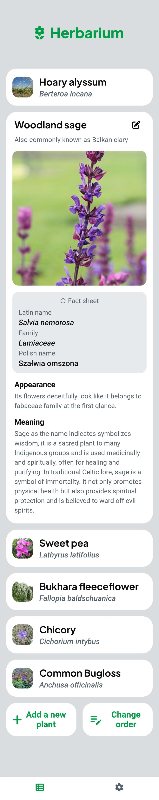

## Herbarium

A Flutter/FlutterFlow app for creating and managing a personal herbarium: add plant entries, upload and manage photos, write descriptions, and organize your collection. Built with Firebase (Auth, Firestore, Storage), GoRouter, and Provider.

### Features
- **Create plant entries**: common/Latin/Polish names, family, appearance, meaning, habitat (list + free text), description, and an ordered position.
- **Photo uploads**: pick multiple images, upload to Firebase Storage, and store download URLs on each plant record.
- **Edit entries**: update fields, merge existing/new images, and delete images from Storage.
- **Reorder collection**: drag-and-drop ordering across the list, persisted in Firestore as an `order` field.
- **Auth-gated app**: login experience backed by Firebase Auth; routes guard based on auth state.
- **Settings & preferences**: UI toggles (e.g., show Polish names, add button placement, title color, habitat view) persisted locally.
- **Internationalization**: English and Polish locales.

### Strengths
- Clean separation of concerns: UI pages, data layer (`backend`), app state, and custom actions.
- Real-time Firestore streams and batched writes for efficient updates.
- Production-ready storage handling with MIME metadata and authenticated rules.
- Extensible auth surface: multiple providers can be enabled without code churn.
- Accessible, localized UI with persistent user preferences.


### Tech stack
- **Framework**: Flutter (generated via FlutterFlow; stable channel)
- **State**: `Provider` for app-level state (`FFAppState`) with `SharedPreferences` persistence
- **Routing**: `go_router` with FlutterFlow navigation helpers
- **Backend**: Firebase
  - Firestore (plants collection and real-time streams)
  - Storage (image uploads)
  - Auth (email/password; other providers available if configured)
- **Media**: `image_picker`, `file_picker`, `cached_network_image`
- **UI/Theming**: FlutterFlow theme system, light/dark modes

### Screenshots

<p>
  
  
  
  
  
</p>

### Data model (Firestore: `plants` collection)
Fields on each document include:
- `name_common` (String)
- `name_latin` (String)
- `name_polish` (String)
- `family` (String)
- `description` (String)
- `meaning` (String)
- `appearance` (String)
- `habitat` (List<String>)
- `text_habitat` (String)
- `images` (List<String>, Firebase Storage URLs)
- `order` (int)

```1:105:flutterflow_apps/herbarium/lib/backend/schema/plants_record.dart
class PlantsRecord extends FirestoreRecord {
  // ...
  // "images" field.
  List<String>? _images;
  List<String> get images => _images ?? const [];
  bool hasImages() => _images != null;

  static CollectionReference get collection =>
      FirebaseFirestore.instance.collection('plants');
}
```

Creation helper used for writes:

```121:147:flutterflow_apps/herbarium/lib/backend/schema/plants_record.dart
Map<String, dynamic> createPlantsRecordData({
  String? nameCommon,
  String? nameLatin,
  String? namePolish,
  String? family,
  String? description,
  String? meaning,
  String? appearance,
  int? order,
  String? textHabitat,
}) {
  final firestoreData = mapToFirestore(
    {
      'name_common': nameCommon,
      'name_latin': nameLatin,
      'name_polish': namePolish,
      'family': family,
      'description': description,
      'meaning': meaning,
      'appearance': appearance,
      'order': order,
      'text_habitat': textHabitat,
    }.withoutNulls,
  );
  return firestoreData;
}
```

### Architecture & logic
- **Firebase init**: web and native init handled at startup.

```4:16:flutterflow_apps/herbarium/lib/backend/firebase/firebase_config.dart
Future initFirebase() async {
  if (kIsWeb) {
    await Firebase.initializeApp(
      options: FirebaseOptions(
        apiKey: "YOUR_WEB_API_KEY",
        authDomain: "YOUR_AUTH_DOMAIN",
        projectId: "YOUR_PROJECT_ID",
        storageBucket: "YOUR_STORAGE_BUCKET",
        appId: "YOUR_WEB_APP_ID",
        messagingSenderId: "YOUR_MESSAGING_SENDER_ID",
      ),
    );
  } else {
    await Firebase.initializeApp();
  }
}
```

- **Routing**: guarded routes with `go_router`. Authenticated users land on a tabbed `NavBarPage`; unauthenticated users see `LoginWidget`.

```81:115:flutterflow_apps/herbarium/lib/flutter_flow/nav/nav.dart
appStateNotifier.loggedIn ? NavBarPage() : LoginWidget(),
routes: [
  FFRoute(name: HomeWidget.routeName, path: HomeWidget.routePath, ...),
  FFRoute(name: SettingsWidget.routeName, path: SettingsWidget.routePath, ...),
  FFRoute(name: AddWidget.routeName, path: AddWidget.routePath, ...),
  FFRoute(
    name: EditWidget.routeName,
    path: EditWidget.routePath,
    asyncParams: {
      'plantDoc': getDoc(['plants'], PlantsRecord.fromSnapshot),
      'docList': getDocList(['plants'], PlantsRecord.fromSnapshot),
    },
  ),
  FFRoute(name: LoginWidget.routeName, path: LoginWidget.routePath, ...),
  FFRoute(name: ReorderWidget.routeName, path: ReorderWidget.routePath, ...),
]
```

- **App state**: `FFAppState` persists user preferences with `SharedPreferences`.

```41:88:flutterflow_apps/herbarium/lib/app_state.dart
late SharedPreferences prefs;
bool _polishNames = true; // persisted
String _uploadImage = '';
bool _addBtnOnTop = true;
bool _greenTitles = false;
bool _mapHabitat = true;
```

### Key flows
- **Create plant** (`AddWidget`)
  - Pick images via ImagePicker/FilePicker, compute storage paths, upload bytes to Storage with metadata, collect download URLs, and write a new `plants` doc with all fields + `images` array and initial `order`.

```291:341:flutterflow_apps/herbarium/lib/flutter_flow/upload_data.dart
String _getStoragePath(String? pathPrefix, String filePath, bool isVideo, [int? index]) {
  pathPrefix ??= _firebasePathPrefix();
  final timestamp = DateTime.now().microsecondsSinceEpoch;
  final ext = isVideo ? 'mp4' : filePath.split('.').last;
  final indexStr = index != null ? '_$index' : '';
  return '$pathPrefix/$timestamp$indexStr.$ext';
}
```

```6:10:flutterflow_apps/herbarium/lib/backend/firebase_storage/storage.dart
Future<String?> uploadData(String path, Uint8List data) async {
  final storageRef = FirebaseStorage.instance.ref().child(path);
  final metadata = SettableMetadata(contentType: mime(path));
  final result = await storageRef.putData(data, metadata);
  return result.state == TaskState.success ? result.ref.getDownloadURL() : null;
}
```

- **Edit plant** (`EditWidget`)
  - Merge existing images with newly uploaded ones and update fields and arrays in-place.
  - Supports deleting an image directly from Storage.

```14:21:flutterflow_apps/herbarium/lib/custom_code/actions/delete_image.dart
Future<String> deleteImage(String urlFile) async {
  try {
    await FirebaseStorage.instance.refFromURL(urlFile).delete();
    return 'Image deleted successfully';
  } catch (e) {
    return e.toString();
  }
}
```

- **Reorder list** (`ReorderWidget`)
  - Reorder locally for smooth UX and then persist all new positions in a single Firestore batch.

```12:24:flutterflow_apps/herbarium/lib/custom_code/actions/reorder_firebase_items.dart
Future<void> reorderFirebaseItems(List<PlantsRecord> list) async {
  final batch = FirebaseFirestore.instance.batch();
  for (int i = 0; i < list.length; i++) {
    final PlantsRecord doc = list[i];
    batch.update(doc.reference, {'order': i});
  }
  await batch.commit();
}
```

### Auth
Firebase Auth integration with support for email/password out of the box; additional providers (Google, Apple, GitHub, Phone, JWT, Anonymous) are scaffolded and can be enabled with configuration.

```1:17:flutterflow_apps/herbarium/lib/auth/firebase_auth/email_auth.dart
Future<UserCredential?> emailSignInFunc(String email, String password) =>
  FirebaseAuth.instance.signInWithEmailAndPassword(email: email.trim(), password: password);
```

### Security rules
- **Firestore**: reads currently public for `plants` (toggle to authed-only if needed); writes require auth.

```1:11:flutterflow_apps/herbarium/firebase/firestore.rules
match /plants/{document} {
  allow read: if true;      // set to isAuthed() to require login
  allow create, update, delete: if isAuthed();
}
```

- **Storage**: reads/writes require auth; pattern provided for per-user scoping if desired.

```1:16:flutterflow_apps/herbarium/firebase/storage.rules
service firebase.storage {
  match /b/{bucket}/o {
    function isAuthed() { return request.auth != null; }
    match /{allPaths=**} { allow read, write: if isAuthed(); }
    match /users/{userId}/{allPaths=**} {
      allow read, write: if request.auth != null && request.auth.uid == userId;
    }
  }
}
```

### Project structure (high level)
- `lib/home` – list/browse plants
- `lib/add` – create entries
- `lib/edit` – edit entries
- `lib/reorder` – drag-and-drop and persist ordering
- `lib/settings` – UI preferences backed by `FFAppState`
- `lib/auth` – Firebase Auth plumbing/providers
- `lib/backend` – Firestore models, queries, and Storage upload helpers
- `lib/custom_code/actions` – custom actions for reorder and image deletion
- `lib/flutter_flow` – generated utilities (theme, i18n, navigation, uploads)

### Internationalization
Supported locales: `en`, `pl`. Text is routed through FlutterFlow's i18n layer.

```114:133:flutterflow_apps/herbarium/lib/main.dart
supportedLocales: const [ Locale('en'), Locale('pl') ],
themeMode: _themeMode,
routerConfig: _router,
```

### Running locally
1. Install Flutter (stable) and Dart SDK; ensure `flutter doctor` passes.
2. From `flutterflow_apps/herbarium`, install deps:
   - `flutter pub get`
3. Firebase setup:
   - Web: set your keys in `lib/backend/firebase/firebase_config.dart` (replace the `YOUR_*` placeholders).
   - Android/iOS/macOS: place your `google-services.json` and `GoogleService-Info.plist` files in their platform folders.
4. Run:
   - `flutter run -d chrome` (web) or select a simulator/device for mobile.

### Security configuration
- Firestore rules: public reads for demo; switch `allow read` to `isAuthed()` in `firebase/firestore.rules` to require login.
- Storage rules: reads/writes require auth by default. For per-user scoping, keep uploads under `users/{uid}/` and use the provided rule block.

